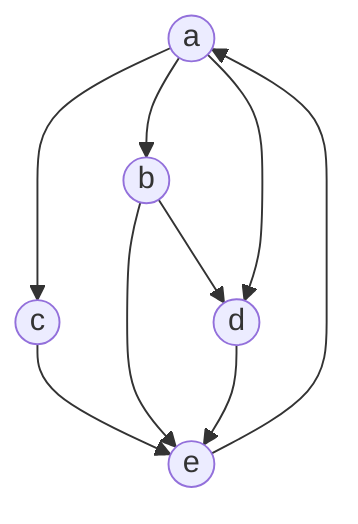

### PageRank算法

基本公式：


- pj皆是链接到pi的网页
- L(pj)是pj链接到别的页面的数量（pj的出度）
- N是所研究的集合中网页的数量
- q为阻尼系数，一般取0.85，表示用户到达某页面后继续向后浏览的概率，1 - q = 0.15就是用户跳到别的URL的概率。

矩阵化公式：

当运算次数不断增加时，每个网页的PR值趋向一个定值

### 举例



图中每个结点代表一个网页


#### 代码示例
```cpp
/**
* page_rank.cpp
* @author Jiang Bingchen
* @description Algorithm homework
* @created 2021-03-09  12:16:58.
* @last-modified 2021-03-12  23:00:35.
*/

#include <bits/stdc++.h>
using namespace std;
/* 
test input(input the following data when you run the program):
5 8
a b
a c
a d
e a
c e
b e
d e
b d

 */
struct webpage
{
    webpage(int a = 0, double b = 0, int c = 0, const string &d = "")
    {
        id = a;
        PR = b;
        outdegree = c;
        name = d;
    }
    int id;
    string name;
    double PR;
    int outdegree;
};
class Page_rank
{
private:
    map<string, webpage> hash;
    vector<webpage> weblist;
    vector<vector<double>> matrix;
    vector<vector<double>> V;
    const double rate = 0.85;
    int size;
    int edge;
    void save_page(webpage &a, int &temp_id)
    {
        if (hash.find(a.name) != hash.end()) //exist！
        {
            return;
        }
        a.id = temp_id;
        a.PR = (double)1 / size;
        hash[a.name] = a;
        weblist.push_back(a);
        temp_id++;
    }
    //calculate the multiplication of two matrices
    vector<vector<double>> multiplication(const vector<vector<double>> &a, const vector<vector<double>> &b)
    {
        int asize1 = a.size(), asize2 = a[0].size();
        int bsize1 = b.size(), bsize2 = b[0].size();
        vector<vector<double>> ret(asize1, vector<double>(bsize2, 0));
        if (asize2 != bsize1)   // can not be calculated!
        {
            cout<<"Error! illegal calculation!"<<endl;
            ret.clear();
            return ret; 
        }
        double temp = 0;
        for (int i = 0; i < asize1; i++)
        {
            for (int j = 0; j < bsize2; j++)
            {
                for (int k = 0; k < asize2; k++)
                {
                    temp += a[i][k] * b[k][j];
                }
                ret[i][j] = temp;
                temp = 0;
            }
        }
        return ret;
    }

public:
    //init the website gragh
    void init()
    {
        int temp_id = 0;
        cin >> size >> edge;    //the number of web and the number of edges in gragh
        matrix.assign(size, vector<double>(size, 0));
        V.assign(size, vector<double>(1, (double)1 / size));
        for (int i = 0; i < edge; i++)
        {
            webpage start, end;
            //to build a edge from starting node to ending node
            cin >> start.name >> end.name;
            save_page(start, temp_id);
            save_page(end, temp_id);
            matrix[hash[end.name].id][hash[start.name].id] = 1;
        }
        for (int i = 0; i < size; i++)
        {
            for (int j = 0; j < size; j++)
            {
                if (matrix[j][i])
                {
                    weblist[i].outdegree++;     //calculate every web's outdegree
                    hash[weblist[i].name].outdegree++;      //update in hash 
                }
            }
            for (int j = 0; j < size; j++)
            {
                if (weblist[i].outdegree)
                    matrix[j][i] = double(matrix[j][i]) / weblist[i].outdegree;//transfer matrix
            }
        }
    }
    void cal_pr()
    {
        webpage temp;
        vector<vector<double>> ret;
        int cal_times = 20;
        while (cal_times--)
        {
            ret = multiplication(matrix, V);
            for (auto &r : ret)
            {
                r[0] *= rate;
                r[0] += (1 - rate) * (1 / (double)size);
            }
            cout << "calculation" << 20 - cal_times << endl;
            for (int i = 0; i < size; i++)
            {
                temp = weblist[i];
                cout << temp.id << " " << temp.name << " PR: " << ret[i][0] << endl;
            }
            V = ret;
        }
    }
};
int main()
{
    Page_rank sol;
    sol.init();
    sol.cal_pr();
}

```
#### 计算结果


#### 可以看出，随着计算次数的增加，pr值逐渐趋于稳定


##### 算法优点：
- 与浏览用户的动态访问无关，可通过离线计算得到pagerank值，节省了大量的时间
##### 算法缺点：
- 并未足够考虑网页中内容的相关性与重要性，仅针对网页的链接状态进行了计算
- 旧的网页等级往往较高，新的网页等级提升较慢


计科1904蒋秉辰
8208190621